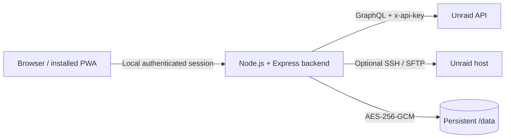

# Unraid Control

A self-hosted, installable Progressive Web App for monitoring and controlling one or more Unraid servers. It combines the Unraid GraphQL API with optional SSH/SFTP access behind a local, authenticated backend so API keys and SSH credentials are never exposed to the browser.

> This is an independent community project and is not affiliated with Lime Technology, Inc.

## Features

- Responsive glass-style interface for desktop, tablet, mobile, and installed PWA use.
- Dashboard with CPU, memory, storage, temperatures, network, hardware, version, registration, UPS, and notification data when exposed by the server.
- Array, parity, disk, cache, and pool monitoring.
- Docker container state, resource statistics, actions, WebUI links, update indicators, and container logs.
- Virtual machine state, actions, metadata icons, and responsive resource cards.
- Share browsing with an SFTP file manager: pagination, upload, download, rename, folder creation, and deletion.
- Server logs with automatic source discovery for syslog, kernel, journal, Nginx, Libvirt, and PHP-FPM.
- Multiple Unraid server profiles with fast switching.
- Local password authentication with signed HttpOnly sessions.
- AES-256-GCM encryption for saved Unraid API keys and SSH credentials.
- Dark and light themes, customizable native selects, and 11 interface languages.
- Installable PWA with circular and maskable application icons.
- Multi-architecture Docker images for `linux/amd64` and `linux/arm64`.

## Architecture



The React application only talks to the local backend. The backend stores server secrets in an encrypted file and performs all GraphQL and SSH operations.

## Requirements

- Docker Engine with Docker Compose v2, or Node.js 22 for development.
- An Unraid server with an accessible GraphQL API and API key.
- Optional SSH access for server logs, Docker logs, VM icons, disk I/O, and the file browser.
- A persistent directory writable by the configured container UID/GID.

Grant the Unraid API key only the read and mutation scopes required by the features you intend to use. Read-only keys can monitor the server; container, VM, array, and notification controls require the corresponding API scopes. File operations require the matching permissions on the configured SSH account.

## Install from GitHub Container Registry

Every push to the default branch publishes an image at:

```text
ghcr.io/moodiness/unraid-control:latest
```

### Unraid template

The repository includes a native Unraid Docker template with the application port, Appdata path, required local password, time zone, and advanced options already defined.

After these files have been pushed to GitHub, open an Unraid terminal and install the template:

```bash
curl -fsSL \
  https://raw.githubusercontent.com/moodiness/unraid-control/main/templates/unraid-control.xml \
  -o /boot/config/plugins/dockerMan/templates-user/my-unraid-control.xml
```

The `my-` prefix is Unraid's convention for templates installed locally by a user. It only affects the filename on the Unraid flash drive; the GitHub source remains `templates/unraid-control.xml`, and the application is still named **Unraid-Control**.

Then:

1. Open the **Docker** tab in Unraid.
2. Select **Add Container**.
3. Choose **Unraid-Control** from the **Template** list.
4. Set **Local UI Password** to a unique value of at least 12 characters.
5. Adjust the WebUI port, Appdata path, and time zone if needed.
6. Select **Apply**.

Unraid will pull `ghcr.io/moodiness/unraid-control:latest`. The template source is [`templates/unraid-control.xml`](templates/unraid-control.xml). Hosting the template on GitHub does not automatically list it in Community Applications; that requires a separate Community Applications submission.

### Docker Compose

```bash
git clone https://github.com/moodiness/unraid-control.git
cd unraid-control
cp .env.example .env
```

Edit `.env` and set at minimum:

```dotenv
LOCAL_AUTH_PASSWORD=replace-with-a-unique-random-password
APPDATA_PATH=/mnt/user/appdata/unraid-control
PUID=99
PGID=100
TZ=Europe/Paris
```

The local password must contain at least 12 characters. A random value can be generated with:

```bash
openssl rand -base64 32
```

Pull and start the published image without building locally:

```bash
docker compose pull
docker compose up -d --no-build
```

Open:

```text
http://<unraid-ip>:2442
```

### Docker CLI

```bash
docker run -d \
  --name unraid-control \
  --restart unless-stopped \
  --user 99:100 \
  -p 2442:3001 \
  -e LOCAL_AUTH_PASSWORD='replace-with-a-unique-random-password' \
  -e TZ='Europe/Paris' \
  -v /mnt/user/appdata/unraid-control:/data \
  --security-opt no-new-privileges:true \
  --cap-drop ALL \
  ghcr.io/moodiness/unraid-control:latest
```

## Build locally

Build the image, then override the Compose image for that invocation:

```bash
docker build -t unraid-control:local .
UNRAID_IMAGE=unraid-control:local docker compose up -d
```

## First-run configuration

1. Sign in with `LOCAL_AUTH_PASSWORD`.
2. Enter a display name for the server.
3. Enter the Unraid WebGUI address, such as `https://192.168.1.10`.
4. Enter an Unraid API key and test the connection.
5. Enable trust for a self-signed certificate only when required on a trusted network.
6. Optionally enable SSH/SFTP, choose password or private-key authentication, and verify the host fingerprint before saving.

Additional servers can be added and switched from **Settings**.

## Environment variables

| Variable               | Required | Default                                   | Description                                                                        |
| ---------------------- | -------- | ----------------------------------------- | ---------------------------------------------------------------------------------- |
| `UNRAID_IMAGE`         | No       | `ghcr.io/moodiness/unraid-control:latest` | Optional Compose image override for local builds.                                  |
| `UNRAID_APP_PORT`      | No       | `2442`                                    | Host port exposed by Docker Compose.                                               |
| `LOCAL_AUTH_PASSWORD`  | Yes      | —                                         | Local UI password, minimum 12 characters. Changing it invalidates active sessions. |
| `PUID`                 | No       | `99`                                      | Container process UID used by Docker Compose.                                      |
| `PGID`                 | No       | `100`                                     | Container process GID used by Docker Compose.                                      |
| `APPDATA_PATH`         | No       | `./data`                                  | Host path mounted at `/data`.                                                      |
| `ARRAY_ENCRYPTION_KEY` | No       | Generated                                 | Exact 32-byte key encoded as base64 or 64 hexadecimal characters.                  |
| `MAX_UPLOAD_BYTES`     | No       | `2147483648`                              | Maximum SFTP upload size in bytes.                                                 |
| `TRUST_PROXY`          | No       | `false`                                   | Set to `true` only behind a trusted reverse proxy.                                 |
| `UNRAID_SCHEMA_URL`    | No       | Automatic                                 | Optional official GraphQL schema URL override.                                     |
| `TZ`                   | No       | `UTC`                                     | Container timezone.                                                                |
| `PORT`                 | No       | `3001`                                    | Internal API port; normally left unchanged in Docker.                              |
| `DATA_DIR`             | No       | `/data`                                   | Internal persistent data directory.                                                |

## Persistent data and backups

The `/data` volume contains:

- `server.enc.json`: encrypted server profiles and credentials.
- `.array-key`: automatically generated encryption key when `ARRAY_ENCRYPTION_KEY` is not supplied.
- `audit.log`: control and file-operation audit entries.

Back up the entire directory. `server.enc.json` cannot be decrypted without the matching `.array-key` or externally supplied `ARRAY_ENCRYPTION_KEY`.

## Security model

- Local password verification uses scrypt and constant-time comparison.
- Sessions are signed, random, HttpOnly, `SameSite=Strict`, and valid for seven days.
- Login attempts are limited to five failures per 15 minutes.
- State-changing API requests enforce same-origin checks and rate limits.
- API keys, SSH passwords, private keys, and passphrases remain on the backend.
- Saved server configuration is encrypted with AES-256-GCM.
- SSH connections require a tested and pinned host fingerprint.
- The container drops all Linux capabilities and enables `no-new-privileges` in Compose.
- The runtime image runs as the unprivileged `node` user unless Compose overrides it with `PUID:PGID`.

Use HTTPS when the application is accessed outside a trusted local network. When using a reverse proxy, terminate TLS there and set `TRUST_PROXY=true` only if the proxy is trusted.

## GitHub Actions and GHCR tags

`.github/workflows/container.yml` runs tests, TypeScript checks, and the production build before creating the container image. Pull requests build without publishing. Pushes and version tags publish to GHCR using the repository's automatic `GITHUB_TOKEN`; no personal access token is required by the workflow.

Published tags include:

- `latest` for the default branch.
- The branch name, such as `main`.
- `sha-<commit>` for immutable deployments.
- `1.2.3` and `1.2` for a Git tag such as `v1.2.3`.

Images include BuildKit provenance and an SBOM. The package is intended to be **Public** so Docker Compose can pull it without GitHub credentials.

## Updating

```bash
docker compose pull
docker compose up -d --no-build
```

Changing `LOCAL_AUTH_PASSWORD` requires recreating the container and invalidates existing sessions:

```bash
docker compose up -d --force-recreate --no-build
```

## Development

Install dependencies:

```bash
npm ci
```

Run both applications on Linux or macOS:

```bash
LOCAL_AUTH_PASSWORD='development-password' npm run dev
```

The frontend is available at `http://localhost:5173`; Vite proxies `/api` and `/health` to the backend on port `3001`.

Quality commands:

```bash
npm test
npm run check
npm run build
docker build -t unraid-control:local .
```

## Project structure

```text
apps/api/                     Express API, GraphQL adapter, SSH/SFTP and auth
apps/web/                     React PWA and responsive interface
.github/workflows/container.yml  CI and GHCR publication
templates/unraid-control.xml  Native Unraid Docker template
templates/unraid-control.png  Template icon
docker-compose.yml            Self-hosted deployment
Dockerfile                    Multi-stage production image
```

## Troubleshooting

### `LOCAL_AUTH_PASSWORD must contain at least 12 characters`

Set a longer password in `.env` and recreate the container.

### `Authentication required`

The API is intentionally inaccessible without a valid local session. Open the web interface and sign in first.

### `Configure SSH file access for this server first`

Enable SSH in the server settings, test the connection, verify the fingerprint, and save the profile.

### Permission errors under `/data`

Ensure `APPDATA_PATH` is writable by `PUID:PGID`. Unraid commonly uses `99:100` (`nobody:users`).

### Self-signed TLS errors

Prefer a trusted certificate. Enable the self-signed option only for a server you control on a trusted network.

### Old PWA interface or icon remains visible

Hard-refresh the page. Installed operating-system icons may require removing and reinstalling the PWA because launcher icons can be cached separately from browser assets.

## License

Released under the [MIT License](LICENSE).
